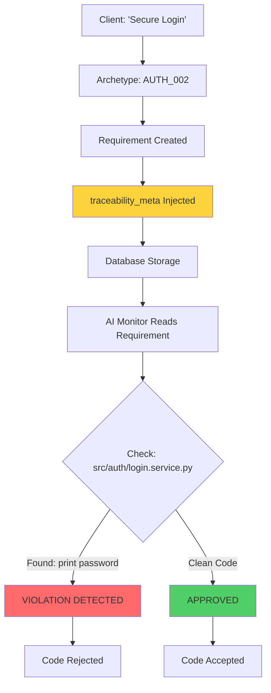

# The "Nervous System" Upgrade

**Status**: ✅ Implemented  
**Version**: 1.0  
**Date**: 2026-01-21

---

## The Problem: The Chinese Whisper

### Before the Nervous System

```
Client says: "Secure Login"
↓
Database stores: "Requirement: Secure Login"
↓
Developer reads: "Build login... somehow?"
↓
AI Monitor checks: "Is this secure? 🤷"
```

**The Gap**: Requirements were **documentation**, not **executable contracts**.

---

## The Solution: Installing Nerve Endings

We don't just store **what to build**; we store **where it lives in the digital body**.

### The Anatomy

```
Requirement (The Brain)
    ↓
traceability_meta (The Nervous System)
    ↓
{
  "module": "auth",
  "required_files": ["src/auth/login.service.py"],
  "forbidden_patterns": ["plain_text_password"],
  "test_coverage_threshold": 100,
  "security_level": "CRITICAL"
}
    ↓
AI Monitor (The Immune System)
    ↓
"Scanning src/auth/login.service.py..."
"Found: print(password) → VIOLATION!"
"Code REJECTED."
```

---

## Implementation Details

### 1. Database Schema Upgrade

**File**: `backend/app/db/models.py`

Added the `traceability_meta` JSONB column to the `Requirement` model:

```python
class Requirement(Base):
    # ... existing fields ...
    
    # The Nervous System - Traceability Metadata (The Nerve Endings)
    traceability_meta = Column(JSONB, default=dict)
    # Example: {
    #   "code_namespace": "src.modules.auth",
    #   "expected_file_pattern": "src/modules/auth/*.ts",
    #   "test_id_pattern": "TEST_AUTH_*",
    #   "security_level": "CRITICAL",
    #   "module": "auth",
    #   "required_files": ["src/auth/service.py"],
    #   "test_coverage_threshold": 100,
    #   "forbidden_patterns": ["plain_text_password", "eval()"]
    # }
```

### 2. Schema Definition (The DNA)

**File**: `backend/app/schemas/archetype.py`

Created the `TechnicalMapping` Pydantic model:

```python
class TechnicalMapping(BaseModel):
    """
    The Nervous System - Technical Coordinates
    Maps requirements to actual code locations and enforcement rules
    """
    module: str  # Module identifier (e.g., 'auth', 'leads')
    required_files: List[str] = []  # Expected file paths
    test_coverage_threshold: int = 80  # Minimum coverage %
    forbidden_patterns: List[str] = []  # Banned code patterns
    code_namespace: Optional[str] = None  # Full namespace path
    expected_file_pattern: Optional[str] = None  # Glob pattern
    test_id_pattern: Optional[str] = None  # Test identifier pattern
    security_level: Optional[str] = None  # CRITICAL, HIGH, MEDIUM, LOW
```

Updated `ArchetypeFeature` to include technical mapping:

```python
class ArchetypeFeature(BaseModel):
    # ... existing fields ...
    
    # The Nerve Ending - Technical Implementation Coordinates
    technical_mapping: Optional[TechnicalMapping] = None
```

### 3. The Hydration Logic (The Installer)

**File**: `backend/app/services/archetype_service.py`

When applying an archetype, the service now injects the nerve endings:

```python
def apply_archetype_to_project(self, db: Session, request: ApplyArchetypeRequest):
    # ... load archetype ...
    
    for feat_id, feat in features_to_add.items():
        # INJECTING THE NERVE ENDINGS
        traceability_meta = {}
        if feat.technical_mapping:
            traceability_meta = feat.technical_mapping.dict(exclude_none=True)
            print(f"🧠 Injecting nerve endings for {feat.id}")
        
        req = Requirement(
            # ... other fields ...
            traceability_meta=traceability_meta,  # INSTALLING THE AUDIT SENSORS
        )
```

### 4. The Archetype Asset (The Blueprint)

**File**: `backend/library/archetypes/RFC-001-CRM-STANDARD.json`

Example feature with technical mapping:

```json
{
  "id": "AUTH_002",
  "category": "Authentication",
  "title": "Secure Login with JWT Tokens",
  "description": "Users can log in with email/password and receive JWT token",
  "standard_hours": 12,
  "complexity": "MEDIUM",
  "acceptance_criteria": "Users can log in, JWT token issued with 24-hour expiry",
  "technical_mapping": {
    "module": "auth",
    "code_namespace": "src.modules.auth.login",
    "required_files": [
      "src/modules/auth/login.service.py",
      "src/modules/auth/jwt_handler.py"
    ],
    "expected_file_pattern": "src/modules/auth/login*.py",
    "test_id_pattern": "TEST_AUTH_LOGIN_*",
    "test_coverage_threshold": 100,
    "forbidden_patterns": [
      "plain_text_password",
      "localStorage.setItem('token'",
      "sessionStorage.setItem('token'"
    ],
    "security_level": "CRITICAL"
  }
}
```

---

## The Verification Flow

### How It Solves the Chinese Whisper



### Example Verification Scenario

**Requirement**: AUTH_002 - Secure Login with JWT Tokens

**Nerve Endings**:
```json
{
  "module": "auth",
  "required_files": ["src/modules/auth/login.service.py"],
  "forbidden_patterns": ["plain_text_password", "localStorage.setItem('token'"],
  "test_coverage_threshold": 100
}
```

**AI Monitor Checks**:
1. ✅ File exists: `src/modules/auth/login.service.py`
2. ❌ Found pattern: `localStorage.setItem('token', jwt)` → **VIOLATION**
3. ❌ Test coverage: 78% → **BELOW THRESHOLD**

**Result**: Code rejected with specific violations cited.

---

## Benefits

### 1. **Executable Requirements**
Requirements are no longer just text—they're **enforceable contracts** with technical coordinates.

### 2. **Automated Compliance**
The AI Monitor can automatically verify:
- ✅ Required files exist
- ✅ Forbidden patterns are absent
- ✅ Test coverage meets threshold
- ✅ Security levels are respected

### 3. **Traceability**
Every requirement knows exactly where it lives in the codebase:
```
Requirement AUTH_002 → src/modules/auth/login.service.py
```

### 4. **Dispute Prevention**
When a client says "this isn't secure," we can show:
- The requirement specified `forbidden_patterns: ["plain_text_password"]`
- The code was scanned and approved
- The test coverage was 100%
- The evidence is in the audit log

### 5. **Knowledge Preservation**
The `forbidden_patterns` field captures **lessons learned**:
```json
{
  "forbidden_patterns": [
    "md5",  // Weak hashing
    "eval()",  // Code injection risk
    "console.log",  // Production leak
    "localStorage.setItem('token'"  // XSS vulnerability
  ]
}
```

---

## Migration Path

### For Existing Requirements

Existing requirements without `traceability_meta` will have an empty dict `{}`. This is **backward compatible**.

To upgrade existing requirements:
1. Identify the archetype they came from
2. Re-apply the archetype (will update metadata)
3. Or manually populate via API/admin panel

### Database Migration

```sql
-- The column already has a default value, so no migration needed
-- Existing rows will have traceability_meta = {}
-- New rows will be populated by the archetype service
```

---

## Future Enhancements

### Phase 2: The AI Monitor

Build the verification engine that:
1. Reads `traceability_meta` from requirements
2. Scans the actual codebase
3. Checks for violations
4. Reports compliance status

### Phase 3: The Constraint Engine Integration

Link `traceability_meta` with the `ConstraintRegistry`:
- When a violation is found, create a constraint
- Use vector search to find similar requirements
- Prevent repeat mistakes across projects

### Phase 4: Real-Time Verification

Integrate with CI/CD:
```yaml
# .github/workflows/scogen-verify.yml
- name: Verify Requirements
  run: scogen verify --project-id $PROJECT_ID
  # Checks all requirements against actual code
  # Fails build if violations found
```

---

## Technical Metadata Fields Reference

| Field | Type | Required | Description | Example |
|-------|------|----------|-------------|---------|
| `module` | string | ✅ | Module identifier | `"auth"` |
| `required_files` | array | ❌ | Files that must exist | `["src/auth/login.py"]` |
| `test_coverage_threshold` | integer | ❌ | Min coverage % (0-100) | `95` |
| `forbidden_patterns` | array | ❌ | Banned code patterns | `["eval()", "md5"]` |
| `code_namespace` | string | ❌ | Full namespace path | `"src.modules.auth"` |
| `expected_file_pattern` | string | ❌ | Glob pattern | `"src/auth/*.py"` |
| `test_id_pattern` | string | ❌ | Test ID pattern | `"TEST_AUTH_*"` |
| `security_level` | string | ❌ | Security classification | `"CRITICAL"` |

---

## Summary

The Nervous System upgrade transforms Scogen from a **documentation system** into an **executable contract platform**.

### Before
```
Requirement: "Secure login"
```

### After
```
Requirement: "Secure login"
  ↓
Nerve Endings: {
  module: "auth",
  required_files: ["src/auth/login.py"],
  forbidden_patterns: ["plain_text_password"],
  test_coverage_threshold: 100
}
  ↓
AI Monitor: "Scanning... APPROVED ✅"
```

**The Chinese Whisper is dead. Long live executable requirements.**
