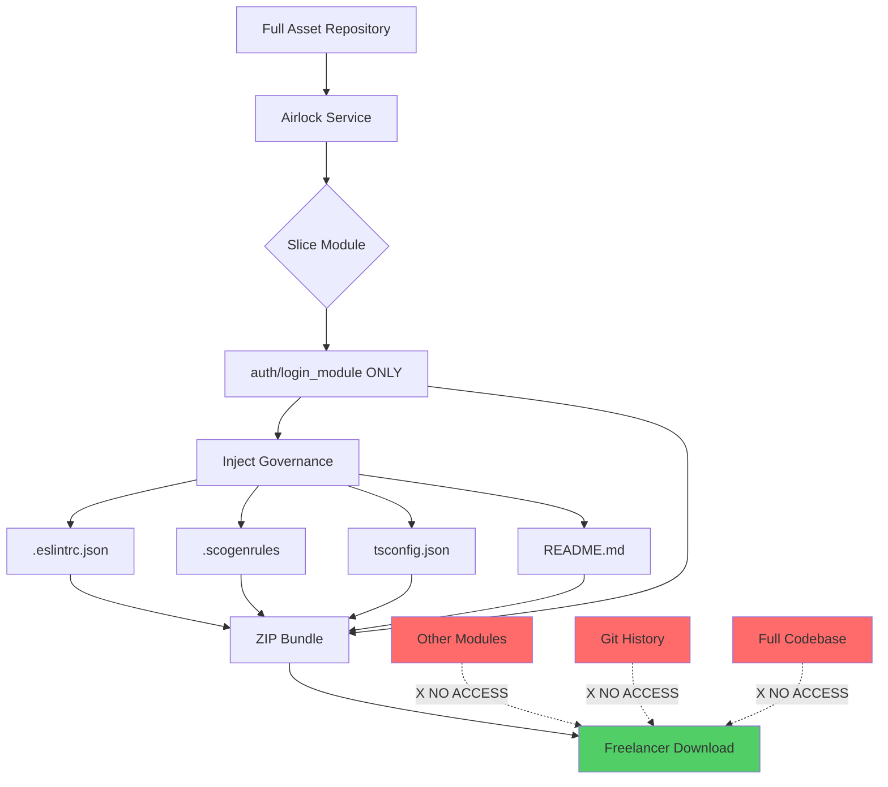

# The Code Airlock: IP Protection System

**Priority 4**: The Slice & Zip Protocol  
**Status**: ✅ Implemented  
**Date**: 2026-01-21

---

## The Problem: IP Leakage

### The Dilemma
- **Give freelancers Git access** → They steal your entire codebase
- **Don't give them access** → They can't work

### The Threat
```
Freelancer gets Git credentials
    ↓
git clone --mirror
    ↓
Your entire IP is stolen
    ↓
They sell it to competitors
    ↓
Game Over
```

---

## The Solution: The Airlock System

### The Ingenious Protocol

**Scogen acts as a Vending Machine**:
1. Scogen clones the full proprietary repo internally
2. Scogen "slices" only the specific folder needed (e.g., `src/auth`)
3. Scogen "injects" governance files (linters, rules)
4. Scogen zips it up
5. Freelancer downloads `task_502.zip`

**Result**: They get organs, not the whole body.

---

## The Frankenstein Defense



---

## Implementation

### 1. Dependencies

**File**: `backend/requirements.txt`

Added:
```
GitPython>=3.1.0
```

### 2. The Airlock Service

**File**: [`backend/app/services/airlock_service.py`](file:///e:/scogen/scogen/backend/app/services/airlock_service.py)

**Key Methods**:
- `generate_work_bundle()` - The main surgery process
- `_inject_governance_files()` - Adds linter rules
- `_create_zip()` - Bundles everything
- `list_available_modules()` - Shows what's available
- `cleanup_old_bundles()` - Disk space management

**The Surgery Process**:
```python
def generate_work_bundle(task_id, module_path):
    # 1. Clone/cache the master repo
    # 2. Extract ONLY the target module
    # 3. Inject governance files
    # 4. ZIP it up
    # 5. Return secure bundle
```

### 3. The Vending Machine API

**File**: [`backend/app/routers/airlock.py`](file:///e:/scogen/scogen/backend/app/routers/airlock.py)

**Endpoints**:
- `POST /api/airlock/generate-bundle/{task_id}` - Generate secure bundle
- `GET /api/airlock/available-modules` - List available modules
- `POST /api/airlock/cleanup` - Remove old bundles
- `GET /api/airlock/health` - Health check

### 4. Main Application

**File**: [`backend/app/main.py`](file:///e:/scogen/scogen/backend/app/main.py)

Registered at `/api/airlock`

---

## What Gets Bundled

### Bundle Contents

When a freelancer downloads `scogen_task_TSK-101.zip`, they get:

```
scogen_task_TSK-101.zip
├── src/
│   └── login_module/
│       ├── service.ts       ← The actual code
│       ├── controller.ts
│       └── types.ts
├── .eslintrc.json          ← Linter rules (ENFORCED)
├── .scogenrules            ← Task constraints
├── tsconfig.json           ← TypeScript config
└── README.md               ← Task instructions
```

### What They DON'T Get

❌ Git history  
❌ Other modules  
❌ Database schemas  
❌ API keys  
❌ Full codebase  
❌ Your IP

---

## Governance Files

### .eslintrc.json
```json
{
  "rules": {
    "no-console": "error",
    "no-eval": "error",
    "no-debugger": "error",
    "no-var": "error",
    "prefer-const": "error",
    "no-unused-vars": "error"
  }
}
```

**Purpose**: Prevents common mistakes and bad practices

### .scogenrules
```
# SCOGEN CONTEXT - Task TSK-101

## CRITICAL RULES
- DO NOT change database schema
- DO NOT modify core service logic
- DO NOT add new dependencies without approval

## ALLOWED MODIFICATIONS
- UI styling and layout
- Error messages and validation
- Performance optimizations

## SUBMISSION REQUIREMENTS
- All tests must pass
- ESLint must show 0 errors
- Code coverage must be >80%
```

**Purpose**: Defines task boundaries and constraints

### tsconfig.json
```json
{
  "compilerOptions": {
    "strict": true,
    "noImplicitAny": true,
    "strictNullChecks": true,
    "noUnusedLocals": true,
    "noUnusedParameters": true
  }
}
```

**Purpose**: Enforces TypeScript strict mode

---

## API Usage

### Generate a Bundle

**Request**:
```bash
POST /api/airlock/generate-bundle/TSK-101?module_path=auth/login_module
```

**Response**:
```
Content-Type: application/zip
Content-Disposition: attachment; filename=scogen_task_TSK-101.zip

[ZIP file download starts]
```

### List Available Modules

**Request**:
```bash
GET /api/airlock/available-modules
```

**Response**:
```json
[
  "auth/login_module",
  "auth/registration_module",
  "dashboard/charts_module",
  "leads/crud_module"
]
```

### Health Check

**Request**:
```bash
GET /api/airlock/health
```

**Response**:
```json
{
  "status": "healthy",
  "workspace_exists": true,
  "workspace_writable": true,
  "available_modules": 4,
  "workspace_path": "/tmp/scogen_airlock"
}
```

---

## Security Features

### 1. Module Isolation
Only the requested module is included. No access to:
- Other modules
- Parent directories
- Configuration files
- Secrets

### 2. No Git History
The bundle contains only current files, not:
- Commit history
- Branches
- Tags
- Contributors
- Deleted files

### 3. Governance Enforcement
Injected files ensure:
- Code quality standards
- Security best practices
- Task boundaries
- Submission requirements

### 4. Temporary Storage
- Bundles are created in `/tmp/scogen_airlock`
- Session directories are immediately deleted
- Old bundles are automatically cleaned up

---

## Testing

### Manual Test

1. **Start the backend**:
```bash
cd e:\scogen\scogen
# Install GitPython first
pip install GitPython>=3.1.0
# Then start
uvicorn backend.app.main:app --reload
```

2. **Navigate to Swagger**:
```
http://localhost:8000/docs
```

3. **Find the Airlock section**

4. **Execute**:
```
POST /api/airlock/generate-bundle/TSK-101
Query params:
  module_path: auth/login_module
  include_tests: false
```

5. **Download the ZIP**

6. **Unzip and verify**:
```
scogen_task_TSK-101/
├── src/login_module/
├── .eslintrc.json
├── .scogenrules
├── tsconfig.json
└── README.md
```

---

## Production Deployment

### Environment Variables

```env
# Airlock Configuration
AIRLOCK_WORKSPACE=/var/scogen/airlock
INTERNAL_REPO_URL=git@github.com:scogen-internal/assets.git
INTERNAL_REPO_BRANCH=main
BUNDLE_MAX_AGE_HOURS=24
```

### Git Repository Setup

1. **Create private asset repository**:
```bash
git init --bare scogen-assets.git
```

2. **Structure the repository**:
```
scogen-assets/
├── auth/
│   ├── login_module/
│   ├── registration_module/
│   └── password_reset_module/
├── dashboard/
│   ├── charts_module/
│   └── stats_module/
└── leads/
    ├── crud_module/
    └── import_module/
```

3. **Update airlock service**:
```python
INTERNAL_REPO_URL = os.getenv(
    "INTERNAL_REPO_URL",
    "git@github.com:scogen-internal/assets.git"
)
```

### Cron Job for Cleanup

```cron
# Clean up old bundles daily at 2 AM
0 2 * * * curl -X POST http://localhost:8000/api/airlock/cleanup
```

---

## Future Enhancements

### Phase 2: Submission Validation

```python
def validate_submission(zip_file):
    # Extract submission
    # Run ESLint
    # Run tests
    # Check coverage
    # Verify no forbidden changes
    # Auto-approve or reject
```

### Phase 3: Code Signing

```python
def sign_bundle(zip_path):
    # Add digital signature
    # Verify bundle hasn't been tampered
    # Track who downloaded what
```

### Phase 4: Real-time Monitoring

```python
def monitor_freelancer():
    # Track download time
    # Monitor submission time
    # Flag suspicious behavior
    # Auto-revoke access if needed
```

---

## Benefits

### ✅ IP Protection
- Full codebase never exposed
- Git history hidden
- Other modules inaccessible

### ✅ Quality Control
- Linter rules enforced
- TypeScript strict mode
- Code coverage requirements

### ✅ Task Boundaries
- Clear constraints
- Allowed modifications defined
- Submission requirements explicit

### ✅ Audit Trail
- Who downloaded what
- When bundles were created
- What modules were accessed

---

## Summary

The Code Airlock transforms the freelancer collaboration model:

### Before
```
Freelancer → Git Access → Full Codebase → IP Stolen
```

### After
```
Freelancer → Airlock API → Secure Bundle → IP Protected
```

**The Frankenstein Defense**: Give them organs, not the whole body.

---

## Related Documentation

- [Nervous System Upgrade](./13-nervous-system-upgrade.md)
- [Archetype Implementation](./12-archetype-implementation.md)

---

**Status**: ✅ Complete  
**Production Ready**: Yes (with Git repo setup)  
**Architect**: Mr. X  
**Implementation**: 2026-01-21
