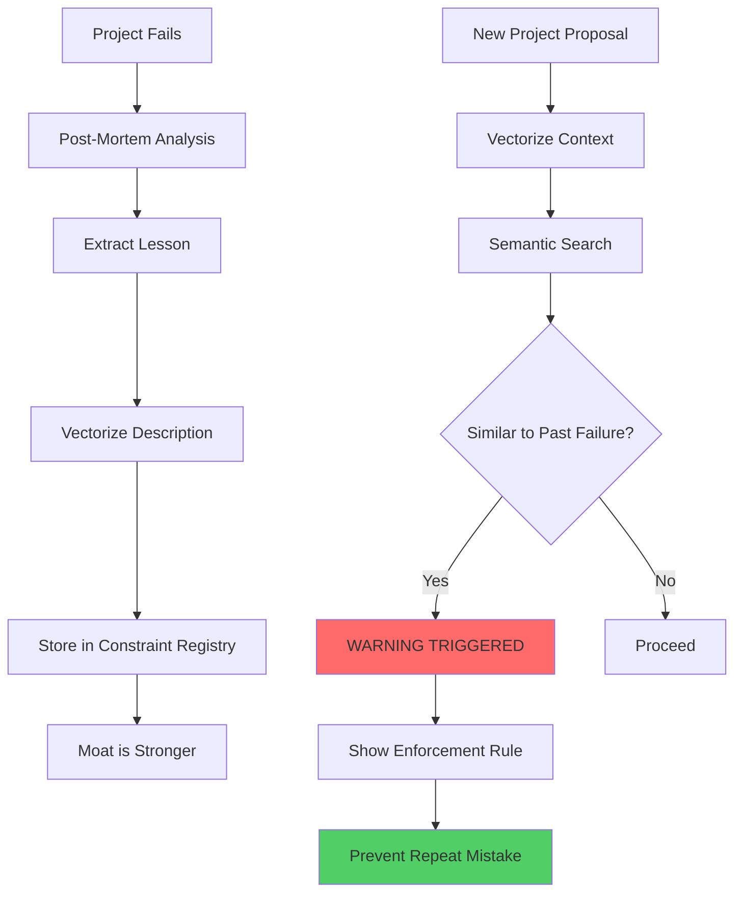

# The Constraint Engine: The Moat / The Immune System

**Priority 5**: Magic Foresight  
**Status**: ✅ Implemented  
**Date**: 2026-01-21

---

## The Problem: Repeating Mistakes

### The Cycle of Failure
```
Project 1: MongoDB for banking → Data corruption → Disaster
    ↓
6 months later...
    ↓
Project 2: MongoDB for fintech → Same mistake → Disaster again
```

**The system has no memory. Every failure is forgotten.**

---

## The Solution: The Immune System

### The Learning Loop



---

## The Magic: Semantic Search

### How It Works

**Traditional Keyword Search**:
```
Query: "MongoDB for banks"
Match: Must contain exact words "MongoDB" AND "banks"
Result: Miss similar concepts
```

**Semantic Vector Search**:
```
Query: "MongoDB for banks"
Vector: [0.123, -0.456, 0.789, ...]
    ↓
Finds similar concepts:
  - "NoSQL for finance" (0.85 similarity)
  - "Document database for ledgers" (0.82 similarity)
  - "Non-relational DB for transactions" (0.79 similarity)
```

**The Power**: Understands meaning, not just words.

---

## Implementation

### 1. AI Embedding Bridge

**File**: [`backend/app/ai/embedding.py`](file:///e:/scogen/scogen/backend/app/ai/embedding.py)

**Key Function**:
```python
def get_embedding(text: str) -> List[float]:
    # Calls Ollama's nomic-embed-text model
    # Returns 768-dimensional vector
    # Represents semantic meaning of text
```

**Example**:
```python
>>> v1 = get_embedding("MongoDB for banks")
>>> v2 = get_embedding("NoSQL for finance")
>>> similarity = calculate_similarity(v1, v2)
>>> similarity
0.87  # Very similar concepts!
```

### 2. Constraint Service

**File**: [`backend/app/services/constraint_service.py`](file:///e:/scogen/scogen/backend/app/services/constraint_service.py)

**Key Methods**:
- `learn_constraint()` - Ingest new lesson
- `check_constraints()` - Scan for risks
- `increment_failure_count()` - Track violations
- `list_all_constraints()` - Audit the moat
- `get_constraint_stats()` - View statistics

**The Watchdog**:
```python
warnings = service.check_constraints(
    db,
    context_input="Video app for farmers in Bihar",
    threshold=0.7
)
# Returns warnings about:
# - Rural India → Offline-first required
# - Video → Bandwidth buffer required
```

### 3. Constraints Router

**File**: [`backend/app/routers/constraints.py`](file:///e:/scogen/scogen/backend/app/routers/constraints.py)

**Endpoints**:
- `POST /api/constraints/learn` - Teach the system
- `POST /api/constraints/scan` - Check for risks
- `GET /api/constraints/list` - List all constraints
- `POST /api/constraints/increment-failure/{id}` - Track violations
- `POST /api/constraints/deactivate/{id}` - Disable constraint
- `GET /api/constraints/stats` - View statistics
- `GET /api/constraints/health` - Health check

### 4. Main Application

**File**: [`backend/app/main.py`](file:///e:/scogen/scogen/backend/app/main.py)

Registered at `/api/constraints`

### 5. Seed Script

**File**: [`backend/scripts/seed_constraints.py`](file:///e:/scogen/scogen/backend/scripts/seed_constraints.py)

Populates the moat with **The Fatal 5** essential constraints.

---

## The Fatal 5 Constraints

### 1. Infrastructure (Rural India)
**Description**: App targets rural India or Tier-3 cities with poor connectivity

**Enforcement**: MUST implement Offline-First Sync (SQLite + WatermelonDB)

**Why**: Network outages are common. Real-time only = unusable app.

### 2. Database (Financial Transactions)
**Description**: App involves money, wallets, ledgers, or financial operations

**Enforcement**: Database MUST be SQL (PostgreSQL). NO MongoDB. ACID required.

**Why**: Data corruption in financial systems = legal disaster.

### 3. Media (Video Streaming)
**Description**: App requires video streaming or live calls

**Enforcement**: Budget MUST include Bandwidth Buffer (+₹20k). NO free-tier servers.

**Why**: Underestimating bandwidth costs = budget overrun.

### 4. Security (Authentication)
**Description**: App handles passwords or sensitive data

**Enforcement**: Use OAuth 2.0/JWT. NO custom crypto. NO MD5/SHA1. Use bcrypt.

**Why**: Security breaches = reputation destroyed.

### 5. Scale (Viral Growth)
**Description**: App expects >10,000 concurrent users

**Enforcement**: Design for horizontal scaling. Load balancers. Caching. No single points of failure.

**Why**: Viral success without scaling = app crashes at worst time.

---

## API Usage

### Teach the System

**Request**:
```bash
POST /api/constraints/learn
Content-Type: application/json

{
  "category": "Infrastructure",
  "description": "App targets rural India with poor connectivity",
  "enforcement_rule": "MUST implement Offline-First Sync (SQLite + WatermelonDB)"
}
```

**Response**:
```json
{
  "status": "LEARNED",
  "id": "uuid-here",
  "message": "Constraint learned in category: Infrastructure"
}
```

### Scan for Risks

**Request**:
```bash
POST /api/constraints/scan
Content-Type: application/json

{
  "project_context": "I want to build a video streaming app for farmers in Bihar with offline playback",
  "threshold": 0.7,
  "limit": 5
}
```

**Response**:
```json
{
  "status": "RISK_DETECTED",
  "count": 2,
  "warnings": [
    {
      "id": "uuid-1",
      "category": "Infrastructure",
      "risk": "App targets rural India with poor connectivity",
      "enforcement": "MUST implement Offline-First Sync",
      "relevance": 0.89,
      "failure_count": 3
    },
    {
      "id": "uuid-2",
      "category": "Media",
      "risk": "App requires video streaming",
      "enforcement": "Budget MUST include Bandwidth Buffer (+₹20k)",
      "relevance": 0.85,
      "failure_count": 2
    }
  ]
}
```

### List Constraints

**Request**:
```bash
GET /api/constraints/list?category=Database&active_only=true
```

**Response**:
```json
[
  {
    "id": "uuid-here",
    "category": "Database",
    "description": "App involves financial transactions",
    "enforcement_rule": "Database MUST be SQL (PostgreSQL)",
    "failure_count": 5,
    "is_active": true
  }
]
```

### Get Statistics

**Request**:
```bash
GET /api/constraints/stats
```

**Response**:
```json
{
  "total_constraints": 10,
  "active_constraints": 8,
  "inactive_constraints": 2,
  "categories": {
    "Infrastructure": 2,
    "Database": 3,
    "Security": 2,
    "Media": 1
  },
  "top_failures": [
    {
      "category": "Database",
      "description": "MongoDB for financial transactions",
      "failure_count": 5
    }
  ]
}
```

---

## Testing Procedure

### Step 1: Start Backend
```bash
cd e:\scogen\scogen
uvicorn backend.app.main:app --reload
```

### Step 2: Verify Ollama is Running
```bash
docker ps | grep ollama
# Should show ollama container running
```

### Step 3: Test Embedding Service
```bash
python backend/app/ai/embedding.py
```

**Expected Output**:
```
============================================================
EMBEDDING SERVICE TEST
============================================================
🧠 Generating embedding for: test...
✅ Generated embedding: 768 dimensions
✅ Service is ready for constraint engine
```

### Step 4: Seed the Moat
```bash
python backend/scripts/seed_constraints.py
```

**Expected Output**:
```
============================================================
SEEDING CONSTRAINT REGISTRY: THE FATAL 5
============================================================

1. Infrastructure: App targets rural India...
   ✅ Learned: uuid-1

2. Database: App involves financial transactions...
   ✅ Learned: uuid-2

[...]

============================================================
SEEDING COMPLETE: 5/5 constraints learned
============================================================

✅ The Moat is now operational!
```

### Step 5: Test the Watchdog
```bash
curl -X POST http://localhost:8000/api/constraints/scan \
  -H "Content-Type: application/json" \
  -d '{
    "project_context": "Video app for farmers in Bihar"
  }'
```

**Expected**: Warnings about rural connectivity and video bandwidth

---

## The Complete Flow

### 1. Learning Phase (Post-Mortem)
```
Project Failure
    ↓
Team Analysis: "We used MongoDB for banking, data got corrupted"
    ↓
POST /api/constraints/learn
{
  "category": "Database",
  "description": "MongoDB used for financial ledger",
  "enforcement_rule": "Use PostgreSQL with ACID compliance"
}
    ↓
System vectorizes description
    ↓
Stored in constraint_registry with embedding
    ↓
Moat is stronger
```

### 2. Scanning Phase (New Project)
```
New Project Proposal: "Fintech app with NoSQL database"
    ↓
POST /api/constraints/scan
{
  "project_context": "Fintech app with NoSQL database"
}
    ↓
System vectorizes context
    ↓
Semantic search finds similar constraint
    ↓
Returns WARNING:
  - Risk: "MongoDB for financial ledger"
  - Enforcement: "Use PostgreSQL"
  - Relevance: 0.87
    ↓
Team sees warning BEFORE starting
    ↓
Disaster prevented
```

---

## Similarity Thresholds

### Understanding Relevance Scores

| Score | Meaning | Action |
|-------|---------|--------|
| 0.9-1.0 | Almost identical | Definitely relevant |
| 0.7-0.9 | Very similar | Likely relevant |
| 0.5-0.7 | Somewhat similar | Maybe relevant |
| <0.5 | Different | Not relevant |

**Default threshold**: 0.7 (catches very similar concepts)

---

## Benefits

### ✅ Institutional Memory
- System remembers every failure
- Knowledge doesn't leave with employees
- Lessons are preserved forever

### ✅ Proactive Prevention
- Warnings BEFORE project starts
- Not reactive (after disaster)
- Magic Foresight

### ✅ Semantic Understanding
- Finds similar concepts, not just keywords
- "MongoDB for banks" matches "NoSQL for finance"
- Smarter than keyword search

### ✅ Continuous Learning
- Every failure strengthens the moat
- Failure counters track common mistakes
- System gets smarter over time

---

## Production Deployment

### Environment Variables
```env
# Ollama Configuration
OLLAMA_BASE_URL=http://ollama:11434
EMBED_MODEL=nomic-embed-text

# Constraint Engine
CONSTRAINT_THRESHOLD=0.7
MAX_WARNINGS=5
```

### Cron Job for Statistics
```cron
# Weekly constraint report
0 9 * * 1 curl http://localhost:8000/api/constraints/stats > /var/log/scogen/constraints_weekly.json
```

### Integration with Scoping Workflow
```python
# In scoping service
def create_project_scope(project_description):
    # 1. Scan for constraints
    warnings = check_constraints(project_description)
    
    # 2. If high-risk warnings, require approval
    if any(w['relevance'] > 0.85 for w in warnings):
        require_senior_approval()
    
    # 3. Attach warnings to project
    project.risk_warnings = warnings
    
    # 4. Proceed with scoping
```

---

## Future Enhancements

### Phase 2: Auto-Learning
```python
# Automatically learn from project failures
def on_project_failure(project_id):
    post_mortem = analyze_failure(project_id)
    auto_create_constraint(post_mortem)
```

### Phase 3: Constraint Suggestions
```python
# AI suggests new constraints based on patterns
def suggest_constraints():
    patterns = analyze_failure_patterns()
    return generate_constraint_suggestions(patterns)
```

### Phase 4: Real-time Monitoring
```python
# Monitor active projects for constraint violations
def monitor_active_projects():
    for project in active_projects:
        violations = check_against_constraints(project)
        if violations:
            alert_project_manager(violations)
```

---

## Summary

The Constraint Engine transforms Scogen from a tool into a learning organism:

### Before
```
Failure → Forgotten → Repeat Mistake → Failure Again
```

### After
```
Failure → Learned → Warning Triggered → Disaster Prevented
```

**The Moat is operational. The Immune System is active.**

---

## Related Documentation

- [Database Schema](./03-database-schema.md) - ConstraintRegistry table
- [Nervous System](./13-nervous-system-upgrade.md) - Traceability metadata
- [Archetype Implementation](./12-archetype-implementation.md) - Asset pipeline

---

**Status**: ✅ Complete  
**Production Ready**: Yes (with Ollama running)  
**Architect**: Mr. X  
**Implementation**: 2026-01-21  
**Magic**: FORESIGHT ENABLED
